# 1 **Présentation du Projet AppTicket**

## **1.1 Introduction**

L'objectif du projet **AppTicket**, réalisé dans le cadre de notre **BTS SIO**, est de concevoir et développer une application web de gestion de tickets d'incidents. Cette application vise à améliorer la gestion des demandes d'assistance et à optimiser le suivi des problèmes rencontrés par les utilisateurs.

Le projet repose sur une architecture **Flask** pour la partie backend,  **SQLAlchemy** et **MySql** pour la gestion des données, et une interface web facilitant l'interaction avec les utilisateurs.

## **1.2 Recueil des besoins**

Avant de lancer l'implémentation, nous avons réalisé un **recueil des besoins** afin d'affiner les exigences du projet. Cette phase a permis de mieux comprendre les attentes des futurs utilisateurs et d'adapter l'architecture de l'application en conséquence.

### **1.2.1 Méthodologie employée**

Nous avons procédé en plusieurs étapes :

-   **Questionnaire en ligne envoyé à des professionnels du secteur** pour identifier les besoins et attentes.
-   **Analyse des processus existants** afin d’identifier les améliorations possibles.
-   **Benchmarking** des solutions existantes pour identifier les bonnes pratiques.
-   **Définition des cas d'utilisation** et formalisation des exigences fonctionnelles et non fonctionnelles.

### **1.2.2 Principaux besoins identifiés**

Suite à cette analyse, nous avons défini les fonctionnalités clés du projet :

1.  **Création et gestion des tickets** avec des statuts clairs (ouvert, en cours, résolu, fermé).
2.  **Authentification et gestion des utilisateurs** avec des rôles distincts (utilisateur, support, administrateur).
3.  **Système de notifications** (email/SMS) pour informer les utilisateurs des mises à jour sur leurs tickets.
4.  **Gestion des priorités et assignation des tickets** aux membres du support.
5.  **Historique et traçabilité** des interventions sur chaque ticket.
6.  **Tableau de bord et statistiques** pour suivre la performance du support.
7.  **API REST** permettant l’intégration avec d’autres systèmes internes.

## **1.3 Conception et architecture**

Sur la base des besoins recueillis, nous avons conçu une architecture modulaire avec les composants suivants :

### **1.3.1 Architecture technique**

-   **Backend (Flask + SQLAlchemy)** : Gère les routes API, la logique métier et l’accès à la base de données.
-   **Base de données (MySQL)** : Stocke les informations des utilisateurs, tickets, et logs d'activités.
-   **Frontend (HTML/CSS/JS)** : Fournit une interface utilisateur intuitive et ergonomique.
-   **Système de notification (SMTP/SMS)** : Permet d’envoyer des alertes en fonction des actions des utilisateurs.
-   **Authentification sécurisée** avec gestion des rôles et permissions.


## **1.4 Implémentation et développements**

-  **Phase 1 : Recueil du besoin** et rédaction du cahier des charge
-  **Phase 2 : Mise en place de l’architecture** et création des bases de données.
-   **Phase 3 : Développement des fonctionnalités principales** (gestion des tickets, authentification, notifications).
-   **Phase 4 : Tests unitaires et intégration** pour valider la stabilité de l’application.
-   **Phase 5: Mise en production.**

```mermaid
gantt
    title GANTT
    dateFormat DD-MM-YYYY
    section Phase 1
        Rédaction et diffusion d’un questionnaire en ligne auprès des professionnels du secteur:a1, 01-10-2024, 3d
        Étude des outils existants et de leurs limites :a2, after a1, 4d
        Recueil des besoins des utilisateurs finaux (employés, techniciens, responsables): a3, after a2, 10d
        Analyse des réponses et identification des fonctionnalités clés:a5, after a3, 2d
        Définition des cas d’utilisation (user stories, scénarios d’utilisation):a6, after a5, 5d
        Rédaction des exigences fonctionnelles et non fonctionnelles:a7, after a6, 5d
        Rédaction du cahier des charges:a8, after a7, 10d
    section Phase 2
        Définition des composants techniques (backend, frontend, base de données, API):b1, after a8, 5d
        Choix des technologies et des frameworks (Flask, SQLAlchemy, MySQL, etc.):b2, after b1, 2d
        Planification de l’infrastructure (hébergement, sécurité, sauvegarde):b3, after b2, 2d
        Mise en place d’un dépôt Git:b4, after b3, d
        Identification des entités et relations (tickets, utilisateurs, rôles, logs):b5, after b4, 5d
        Création Modèle Conceptuel de Données:b6, after b5, 10d
        Rédaction des scripts SQL pour la structure initiale de la base.:b7, after b6, 5d
        Installation des outils et dépendances (Python, Flask, SQLAlchemy, etc.).:b8, after b3, 6d
        Configuration de l’environnement de développement (Docker, virtualenv).:b9, after b8, 2d
    section Phase 3
        Création des modèles de base de données (tickets, utilisateurs, rôles):c1, after b6, 10d
        Gestion de l’authentification et des autorisations:c2, after c1, 5d
        Intégration des formulaires de connexion et d’inscription:c3, after c1, 5d
        Mise en place des routes API pour la gestion des tickets:c4, after c2, 15d
        Création et gestion des différents statuts de ticket (ouvert, en cours, fermé):c5, after c3, 5d
        Implémentation du système de notifications (email/SMS):c6, after c5, 10d
        Interface pour la création et le suivi des tickets:c7, after c6, 15d
        Création du tableau de bord utilisateur:c8, after c7, 10d
        Système d’assignation et de priorisation des tickets:c9, after c8, 10d
        Ajout d’une base de connaissances pour l’assistance:c10, after c9, 15d
        Gestion des rapports et statistiques sur les incidents:c11, after c10, 10d
        Automatisation de certaines tâches (relance automatique des tickets non traités):c12, after c11, 10d
    section Phase 4
        Création des tests unitaires pour chaque fonctionnalité clé (pyunit):d1, after c1, 110d
        Vérification de la cohérence des données et du bon fonctionnement des API:d2, after d1, 5d
        Vérification des interactions entre les différents modules:d3, after d2, 3d
        Simulation de scénarios utilisateur et correction des bugs:d4, after d3, 3d
        Tests de performance et optimisation du temps de réponse:d5, after d4, 3d
        Vérification de l’authentification et des autorisations:d6, after d5, 3d
        Analyse des logs et mise en place d’alertes de sécurité:d7, after d6, 3d
    section Phase 5
        Configuration de l’environnement de production (VPS):e1, after d6, 3d
        Mise en place d’une politique de sauvegarde automatique:e2, after e1, 3d
        Déploiement des services backend et frontend:e3, after e2, 3d
        Configuration des domaines et certificats SSL:e4, after e3, 3d
        Mise en place d’un système de surveillance (logs, alertes):e5, after e4, 3d
        Tests finaux avec les utilisateurs et corrections des derniers bugs:e6, after e5, 3d
        Rédaction de manuel utilisateur:e7, after e6, 5d
```


# 2 **Questionnaire en ligne auprès des professionnels**

[Quesitonnaire version PDF](docs/CollecteInformationsBTS-SIO.pdf)

[Questionnaire version en ligne](https://forms.gle/usFrgu5Hq5fD4uCE9)

# 3 **Analyse des réponses et identification des fonctionnalités**

## 3.1 Introduction  

Cette section présente l’analyse des résultats obtenus concernant la gestion des incidents et les outils utilisés dans l’organisation. L’objectif est d’identifier les points forts et les limites du système actuel, ainsi que les besoins et attentes des différentes parties prenantes (utilisateurs, techniciens et responsables).  

L’étude porte sur plusieurs aspects essentiels :  
- **Les moyens de signalement des incidents et les outils en place**  
- **Les volumes d’incidents traités et les périodes de forte activité**  
- **Les attentes et préférences des utilisateurs, techniciens et responsables**  
- **Les besoins en matière de fonctionnalités, d’automatisation et de conformité**  
- **Les exigences en termes d’infrastructure et de déploiement**  

Cette analyse permettra d’orienter le choix et l’implémentation d’une nouvelle solution, plus efficace et adaptée aux attentes de l’organisation.


## **3.2 Actuel : Signalement des incidents et outils utilisés**
- **Moyens de signalement** : GLPI, appels téléphoniques, tickets, JIRA, Teams.
- **Outils/canaux en place** : GLPI, mails, Office 365 (Teams, Outlook), Slack, Zoom, Google Workspace.
- **Problèmes majeurs** :
  - Limites techniques et coûts.
  - Logs incomplets, difficulté d'assigner un ticket à plusieurs personnes.
  - Multiplicité des systèmes pour les demandes hors ticketing.

## **3.3 Volumes et périodes**
- **Incidents traités/semaine** :
  - 20% traitent 1 à 2 incidents.
  - 30% gèrent 5 à 10 incidents.
  - 20% gèrent 10 à 20 incidents.
  - 30% dépassent les 20 incidents.
- **Périodes de pointe** :
  - Les lundis matins et après-midi.
  - Après les mises à jour, en dehors des vacances scolaires.


## **3.4 Attentes pour une nouvelle application**
1. **Simplicité d’utilisation** (employés et techniciens).
2. **Fonctionnalités clés** :
   - Suivi détaillé (nouveau, en cours, clos...).
   - Notifications par email, SMS.
   - Gestion des dépendances entre tickets.
3. **Modularité** :
   - Plugins et intégrations (ex : Azure Active Directory, Grafana).
   - Possibilité de lier tickets internes/externes.
4. **Automatisation** : Processus simplifiés et rapides.
5. **Rapports** :
   - Temps de résolution, volumes, problèmes récurrents.
   - Rapports hebdomadaires/mensuels.
6. **Conformité** : Respect du RGPD et des normes internes.


## **3.5 Préférences utilisateurs**
- **Signalement** : Formulaires en ligne, téléphone avec alertes directes.
- **Suivi des tickets** :
  - Notifications par email/SMS.
  - Statut du ticket, délais, nom du technicien.
  - Fréquence : à chaque changement ou toutes les heures si besoin.
- **Première réponse** : Entre 1 et 2 jours.
- **Matériel utilisé** : PC, tablettes, smartphones.


## **3.6 Préférences techniciens**
- **Réception des tickets** : Mail (listes de diffusion), dashboard, bots Slack.
- **Catégorisation** :
  - Type (matériel/logiciel), priorité, état actuel.
  - Affectation par service/opérateur avec des délais pour l’acceptation et le traitement.
- **Indicateurs importants** :
  - Volume de tickets traités, temps de résolution, nombre de tickets en retard.
- **Outils additionnels** :
  - Base de connaissances, chat utilisateur/technicien, liaison des tickets.


## **3.7 Besoins responsables**
- **Rapports souhaités** :
  - Tickets par service, temps moyen de résolution, problèmes récurrents.
  - Fréquence : hebdomadaire (lundi 10h) ou mensuelle.
- **Accès aux données** :
  - Utilisateurs standards : uniquement leurs tickets.
  - Responsables : vision globale et rapports.
- **Base de connaissances** : FAQ, guides, procédures.

## 3.8 **Autres besoins**
- **Déploiement** : Préférences variées (cloud, serveur local).
- **Sauvegardes** :
  - Sauvegarde quotidienne/hebdomadaire (tickets, logs, base de connaissances).
  - Continuité de service pendant les heures de travail.

## 3.9 **Bilan**


### 3.9.1 Principes clés
- **Facilité de déploiement :**
  - Pas besoin de compétences techniques poussées.
  - Faible coût.
  - Déploiement possible via un simple script.
  - Option de déploiement en mode self-host.
- **Faible consommation de ressources.**
- **Simplicité d'utilisation pour les employés et les techniciens.**

### 3.9.2 Fonctionnalités clés
- **Suivi des tickets :**
  - Suivi détaillé (nouveau, en cours, clos).
  - Notification par email et SMS.
  - Affichage du statut du ticket, délais, et nom du technicien.
  - Fréquence des notifications : à chaque changement ou toutes les heures si besoin.
- **Gestion des tickets :**
  - Catégorisation par type (matériel/logiciel), priorité, et état actuel.
  - Affectation par service/opérateur avec délais pour acceptation et traitement.
- **Rapports :**
  - Graphiques sur les volumes, temps de résolution, et problèmes récurrents.
  - Rapports hebdomadaires et mensuels.
  - Indicateurs importants : volume de tickets traités, temps de résolution, nombre de tickets en retard.
  - Rapports spécifiques pour les responsables : tickets par service, temps moyen de résolution, problèmes récurrents.
  - Fréquence des rapports : hebdomadaire (lundi à 10h) et mensuelle.

### 3.9.3 Conformité et sécurité
- **Respect du RGPD et des normes internes.**
- **Accès aux données :**
  - Utilisateurs standards : uniquement leurs tickets.
  - Responsables : vision globale et accès aux rapports.

### 3.9.4 Compatibilité matérielle
- Utilisation sur PC, tablettes, et smartphones.

### 3.9.5 Interfaces et expérience utilisateur
- **Pour les techniciens :**
  - Notification par email et dashboard.
  - Accès à une base de connaissances.
  - Chat utilisateur/technicien.
- **Pour les utilisateurs finaux :**
  - Signalement via formulaires en ligne ou par téléphone.
  - Suivi du statut des tickets avec notifications.

### 3.9.6 Infrastructure et déploiement
- **Préférences variées pour le déploiement :**
  - Cloud ou serveur local.


# 4 **Comparaisons des outils existants**

## 4.1 **Critères de comparaison**

Nous évaluerons les solutions selon plusieurs critères :

- Facilité d’utilisation
- Fonctionnalités principales
- Personnalisation
- Intégrations
- Tarification
- Public cible

## 4.2 **Comparatif des solutions populaires**

| Outil	| Facilité d’utilisation (1 à 5) | Fonctionnalités principales | Personnalisation | Intégrations | Tarification | Public cible |
|-------|------------------------|-----------------------------|------------------|--------------|--------------|--------------|
|Jira Service Management|	4	|Gestion avancée des tickets, workflows ITIL, SLA, reporting puissant|	Élevée (workflows, automatisation)	|Jira, Confluence, Slack, API REST	| abonnement mensuel	|Grandes entreprises, ITSM|
|Zendesk Support	|4|	Support multi-canal (email, chat, téléphone), IA, base de connaissances|	Moyenne	|Slack, CRM, API REST	| payant selon les plans|	PME et grandes entreprises|
|Freshservice	|4	|ITIL-ready, gestion d’actifs, automatisation, self-service|	Moyenne|	Microsoft Teams, Slack, Zapier	|abonnement	|IT et support interne|
|GLPI	|3	|Gestion des tickets et parc informatique, open-source	|Élevée|	Plugins et API	| open-source	|PME, collectivités|
|OTRS	|3	|Gestion ITSM, flux de travail personnalisables	|Élevée|	API REST, CRM, intégrations multiples	| open-source |IT, service client|
|Mantis Bug Tracker	|3	|Simple, gestion des tickets et bugs, notifications	|Faible|	Email, API	| open-source | Développeurs, équipes tech|
|Spiceworks Help Desk	|3	|Interface intuitive, gestion des tickets et rapports	|Faible	| Microsoft 365, Slack	| publicité |PME et IT interne|
|ServiceNow ITSM	|5	|ITSM complet, IA, automatisation avancée	|Très élevée|	Microsoft, AWS, API REST	| très cher |	Grandes entreprises, ITIL


## 4.3 **Détails des outils les plus populaires**

### 4.3.1 Jira Service Management
Avantages :
- Puissant pour les grandes équipes IT (ITIL, SLA).
- Intégration native avec l’écosystème Atlassian.
- Automatisations avancées.
Inconvénients :
- Courbe d’apprentissage.
- Payant.
### 4.3.2 Zendesk Support
Avantages :
- Interface moderne et intuitive.
- Support multi-canal performant (email, chat, téléphone).
- Fonctionnalités IA pour automatiser les réponses.
Inconvénients :
- Coût élevé pour les entreprises en croissance.
- Personnalisation limitée comparée à Jira.
### 4.3.3 Freshservice
Avantages :
- Spécialisé pour l’IT et la gestion des incidents.
- Interface simple.
- Gestion d’actifs intégrée.
Inconvénients :
- Moins d’intégrations natives que Zendesk/Jira.
- Payant.
### 4.3.4 GLPI (Open-source)
Avantages :
- Gratuit et open-source.
- Gestion complète des tickets et du parc informatique.
- Adapté aux PME et administrations.
Inconvénients :
- Interface vieillissante.
- Configuration plus complexe qu’une solution cloud.
### 4.3.5 OTRS
Avantages :
- Open-source, flexible et personnalisable.
- Fonctionnalités ITSM avancées.
- Idéal pour le support IT.
Inconvénients :
- Interface technique.
- Maintenance et mise à jour à gérer soi-même.

## 4.4 Recommandations selon l’usage

| Besoin | Solution recommandée |
|--------|----------------------|
| Petite entreprise | Spiceworks (gratuit) ou Freshservice |
| PME/PMI |	Jira Service Management ou ServiceNow |
| Organisation publique |	GLPI ou OTRS |
| Développeurs (suivi des bugs)	| Mantis Bug Tracker|


# 5 **Définition des cas d’utilisation**

## 5.1 Introduction  

Cette section décrit les différents cas d'utilisation du système de gestion des tickets. L'objectif est d'identifier les interactions possibles entre les utilisateurs (administrateurs, techniciens et utilisateurs standards) et l'application, en détaillant les actions réalisables et les fonctionnalités attendues.  

Les cas d'utilisation couvrent plusieurs aspects essentiels du système, notamment :  
- **La création et la gestion des tickets** (création, consultation, modification, assignation, clôture).  
- **L'interaction avec les tickets** (ajout de commentaires, suivi des notifications).  
- **L'administration du système** (gestion des utilisateurs, modifications des rôles, gestion des notifications).  
- **Les fonctionnalités avancées** (statistiques, assistance IA, authentification).  

Ces cas d'utilisation permettront de mieux comprendre les besoins des utilisateurs et de garantir que la future solution réponde efficacement aux exigences fonctionnelles et opérationnelles.


## 5.2 **Schéma**


## 5.3 **Cas d'utilisation**

### 5.3.1 Créer un ticket

Utilisateur : Tous

#### 1 - Accéder à la page de création de ticket**

- L'utilisateur peut accéder à l'option créer un ticket via le menu principal "mes tickets".

#### 2 - Cas d'utilisation

- Saisir les informations du ticket : titre du ticket, description du problème, priorité du ticket.
- Valider la création : cliquer sur soumettre le ticket.
- Le ticket est alors enregistré et visible dans la section "mes tickets" pour l'utilisateur, ainsi que dans "tous les tickets" pour l'admin et les techniciens.
- Notification : une notification est envoyée à l'admin pour informer de la création du ticket.

---

### 5.3.2 Voir tous les tickets

Utilisateurs : admin, technicien

#### 1 - Accéder à la page "Tous les tickets"

- Les utilisateurs admin et technicien disposent d'une section "tous les tickets" accessible depuis leur menu principal.

#### 2 - Cas d'utilisation

- Parcourir la liste complète des tickets pour obtenir des informations détaillées.
- Supprimer des tickets 

---

### 5.3.3 Consulter un ticket

Utilisateur: admin, technicien, utilisateur

#### 1 - Accéder à un ticket

- Un utilisateur admin et technicien via la page "tous les tickets" peut consulter le détail d'un ticket.
- Un utilisateur simple via la page "mes tickets" peut consulter le détail de son ticket.

---

### 5.3.4 Ajouter un commentaire à un ticket

Utilisateur : admin, technicien, utilisateur

#### 1 - Accéder à la page de détail du ticket

- Un utilisateur peut ouvrir la fiche détaillée d'un ticket depuis les sections "tous les tickets" ou "mes tickets".

#### 2 - Cas d'utilisation

- Saisir un commentaire dans la zone dédiée.
- Confirmer l'ajout du commentaire en cliquant sur "ajouter un commentaire".
- Un utilisateur peu modifier ou supprimer son commentaire.
- Une notification peut être envoyée à l'utilisateur lorsqu'un nouveau commentaire est ajouté.

---

### 5.3.5 Prendre en charge un ticket

Utilisateur : technicien

#### 1 - Accéder à la liste des tickets

- Le technicien sélectionne un ticket depuis la section "tous les tickets" ou via une recherche spécifique.
- Une option "prendre en charge" est disponible sur chaque ticket non assigné.

#### 2 - Cas d'utilisation

- Cliquer sur prendre en charge pour s'auto-assigner le ticket.
- Le ticket est mis à jour avec l'état en cours et le nom du Technicien associé.
- Une notification peut être envoyée à l'utilisateur concerné pour informer de la prise en charge.
- Une fois pris en charge, le technicien peut mettre à jour le statut, ajouter des commentaires et clôturer le ticket.

---

### 5.3.6 Assigner un ticket

Utilisateur : Admin

#### 1 - Cas d'utilisation

- L'admin sélectionne un ticket depuis la liste.
- Une fois dans le détail du ticket, il peut assigner le ticket à un utilisateur spécifique.

---

### 5.3.7 Modifier un ticket

Utilisateur : admin, technicien

#### 1 - Accéder à la modification d'un ticket

- L'admin ou le technicien sélectionne un ticket depuis la liste des tickets pour ouvrir sa fiche détaillée.

#### 2 - Cas d'utilisation

- Modifier le titre du ticket.
- Mettre à jour la description du problème.
- Changer l'état du ticket.

---

### 5.3.8 Clôturer un ticket

Utilisateur : admin, technicien

#### 1 - Accéder à la clôture d'un ticket

- Une fois un ticket traité, l'admin ou le technicien peut sélectionner l'option "clôturer le ticket".

#### 2 - Cas d'utilisation

- Le système enregistre l'état du ticket comme clôturé et empêche toute nouvelle modification.
- Une notification peut être envoyée à l'utilisateur concerné pour l'informer de la résolution du ticket.

---

### 5.3.9 Consulter les tickets supprimés

Utilisateur : admin

#### 1 - Accéder aux tickets supprimés

- L'admin peut accéder à une section spécifique tickets supprimés via le menu principal.

#### 2 - Cas d'utilisation

- Visualiser les tickets récemment supprimés avec leurs détails.

---

### 5.3.10 Gérer ou modifier un utilisateur

Utilisateur : Admin

#### 1 - Accéder à la page de gestion des utilisateurs

- L'utilisateur connecté avec le rôle admin dispose d'une section "gestion des utilisateurs" accessible depuis son menu principal.

#### 2 - Cas d'utilisation

- L'admin peut créer de nouveaux comptes ou retirer des comptes existants.
- Il peut aussi attribuer l'un des rôles suivants : admin, technicien, ou utilisateur.

---

### 5.3.11 Changer le mot de passe

Utilisateur : admin

#### 1 - Accéder à la page de changement de mot de passe

- L'admin peut accéder à l'option changer mon mot de passe depuis le profil d'un utilisateur.

#### 2 - Cas d'utilisation

- Changer le mot de passe de l'utilisateur.
- Une notification peut être envoyée par email après un changement de mot de passe réussi.

---

### 5.3.12 Voir les statistiques

Utilisateurs : admin, technicien

#### 1 - Accéder à la page de statistiques

- Les utilisateurs ayant le rôle admin ou technicien disposent d'une section statistiques accessible depuis leur menu principal.

#### 2 - Cas d'utilisation

- Consulter les statistiques des tickets pour obtenir une vue d'ensemble des performances et des tendances.

---

### 5.3.13 Gérer les notifications

Utilisateur : admin

#### 1 - Accéder à la gestion des notifications

- L'admin peut accéder à une section notifications via le profil de l'utilisateur.

#### 2 - Cas d'utilisation

- Activer ou désactiver les notifications par email ou SMS pour un utilisateur.

---

### 5.3.14 Poser une question à l'IA

Utilisateur : Tous

#### 1 - Accéder à l'interface de l'IA

- L'utilisateur peut accéder à une Assistance IA via le menu principal.

#### 2 - Cas d'utilisation

- L'utilisateur pose son problème à l'IA.
- L'IA s'appuie sur la base de connaissances pour répondre à la question.

---

### 5.3.15 Authentification

Utilisateur : admin, technicien, utilisateur

- Peut se connecter, accéder à la page d'accueil et se déconnecter.

#### 1 - Cas d'utilisation

- L'utilisateur entre son nom d'utilisateur et son mot de passe.
- Le système vérifie les identifiants.
- Si corrects, l'utilisateur est authentifié et redirigé vers la page d'accueil.

#### 2 - Accéder à la page d'accueil

- Un utilisateur authentifié peut accéder à la page d'accueil.
- Si non authentifié, il est redirigé vers la page de connexion.

#### 3 - Déconnexion

- L'utilisateur clique sur "Se déconnecter".
- Le système supprime la session et redirige vers la page de connexion.


# 6 **Exigences fonctionnelles et non fonctionnelles**

## 6.1 **Description**

- ID : Identifiant unique de l’exigence (F = Fonctionnelle, NF = Non fonctionnelle).
- Exigence : Nom de l’exigence.
- Description : Explication détaillée de l’exigence.
- Priorité : Niveau d'importance (Haute, Moyenne, Basse).

### 6. Exigences fonctionnelles et non fonctionnelles  

#### 6.1 Description  

Chaque exigence est définie par :  
- **ID** : Identifiant unique (F = Fonctionnelle, NF = Non fonctionnelle).  
- **Exigence** : Nom de l’exigence.  
- **Description** : Explication détaillée de l’exigence.  
- **Priorité** : Niveau d’importance (Haute, Moyenne, Basse).  

---

## 6.2 Exigences  

| ID      | Exigence                     | Description | Priorité |
|---------|------------------------------|--------------------------------------------|----------|
| **F-001** | Authentification | L'utilisateur doit pouvoir se connecter avec un identifiant et un mot de passe. | Haute |
| **F-002** | Création de tickets | L'utilisateur doit pouvoir créer un ticket en renseignant un titre, une description et une priorité. | Haute |
| **F-003** | Consultation des tickets | Un utilisateur doit pouvoir voir ses propres tickets, et les techniciens/admins doivent pouvoir voir tous les tickets. | Haute |
| **F-004** | Modification des tickets | Les admins et techniciens doivent pouvoir modifier les détails d’un ticket (titre, description, statut). | Haute |
| **F-005** | Assignation des tickets | L’admin doit pouvoir assigner un ticket à un technicien. | Haute |
| **F-006** | Prise en charge d’un ticket | Un technicien doit pouvoir s’auto-assigner un ticket non attribué. | Haute |
| **F-007** | Ajout de commentaires | Les utilisateurs, techniciens et admins doivent pouvoir commenter un ticket. | Moyenne |
| **F-008** | Clôture des tickets | Les techniciens et admins doivent pouvoir clôturer un ticket une fois résolu. | Haute |
| **F-009** | Gestion des utilisateurs | L’admin doit pouvoir ajouter, modifier ou supprimer des utilisateurs. | Haute |
| **F-010** | Notifications | Le système doit envoyer des notifications par email/SMS lors des mises à jour importantes d’un ticket. | Moyenne |
| **F-011** | Gestion des rôles | L’admin doit pouvoir attribuer des rôles (utilisateur, technicien, admin). | Haute |
| **F-012** | Consultation des statistiques | Les admins et techniciens doivent pouvoir voir des statistiques sur les tickets. | Moyenne |
| **F-013** | Assistance IA | Les utilisateurs doivent pouvoir poser des questions à une IA pour obtenir de l’aide sur un problème. | Basse |
| **F-014** | Suppression des tickets | Un admin doit pouvoir supprimer un ticket si nécessaire. | Moyenne |
| **F-015** | Accès aux tickets supprimés | Les admins doivent pouvoir voir une liste des tickets supprimés. | Basse |

---

## Exigences non fonctionnelles  

| ID      | Exigence                     | Description | Priorité |
|---------|------------------------------|--------------------------------------------|----------|
| **NF-001** | Compatibilité | L’application doit fonctionner sur les navigateurs récents (Chrome, Firefox, Edge). | Moyenne |
| **NF-002** | Accessibilité | L’application doit être utilisable sur PC, tablettes et smartphones. | Haute |
| **NF-003** | Sécurité | Le système doit respecter les normes de sécurité (chiffrement des mots de passe, protection des données). | Haute |
| **NF-004** | Conformité | Respect du RGPD et des normes internes de gestion des données. | Haute |
| **NF-005** | Performance | L’application doit répondre en moins de 2 secondes pour chaque action utilisateur. | Moyenne |
| **NF-006** | Sauvegarde | Des sauvegardes automatiques doivent être effectuées quotidiennement. | Haute |
| **NF-007** | Évolutivité | Le système doit permettre l’ajout de nouvelles fonctionnalités via des modules/plugins. | Moyenne |
| **NF-008** | Disponibilité | Le système doit être accessible 99,9 % du temps pendant les heures de bureau. | Haute |
| **NF-009** | Interface intuitive | L’interface utilisateur doit être simple et ergonomique pour une prise en main rapide. | Haute |
| **NF-010** | Intégration | L’application doit pouvoir s’intégrer avec des outils tiers comme Azure AD, Slack et Grafana. | Moyenne |

---

Cette liste garantit que le futur système de gestion des tickets répond aux besoins fonctionnels et techniques de l’organisation.

# 7 **Modèle conceptuel de données**

```mermaid
graph TD;
    A[Utilisateur crée un ticket] -->|Remplit formulaire| B[Ticket soumis]
    B -->|Notification envoyée| C[Admin et techniciens reçoivent le ticket]
    C -->|Admin assigne le ticket| D[Technicien prend en charge]
    D -->|Analyse et diagnostic| E[Travail sur la résolution]
    E -->|Ajout de commentaires| F[Utilisateur informé]
    E -->|Problème résolu| G[Ticket clôturé]
    G -->|Notification de clôture| H[Fin du processus]
    
    %% Cas alternatif: Ticket non résolu
    E -.->|Besoin d'infos| I[Demande d'informations à l'utilisateur]
    I -->|Réponse utilisateur| E
```



📌 **Explication :**  
- L'utilisateur soumet un ticket via le formulaire.  
- Le ticket est enregistré et les admins/techniciens sont notifiés.  
- Un admin assigne le ticket à un technicien (ou un technicien peut s'auto-assigner).  
- Le technicien analyse et travaille sur le problème.  
- Il peut demander des informations supplémentaires si nécessaire.  
- Une fois résolu, il clôture le ticket et l'utilisateur est notifié.  


# 8 **Structure du projet**

```plaintext

AppTicket/
│
├── app/  # Contient le code source de l'application Flask
│   ├── __init__.py  # Fichier d'initialisation pour l'application Flask
│   ├── config.py  # Configuration de l'application (base de données, environnement, etc.)
│   ├── models/  # Contient les modèles SQLAlchemy
│   │   ├── __init__.py  # Fichier d'initialisation pour les modèles
│   │   ├── user.py  # Modèle pour les utilisateurs
│   │   ├── ticket.py  # Modèle pour les tickets d'incidents
│   │   └── ...  # Autres modèles 
│   ├── routes/  # Contient les routes (endpoints API)
│   │   ├── __init__.py  # Fichier d'initialisation pour les routes
│   │   ├── user_routes.py  # Routes liées aux utilisateurs
│   │   ├── ticket_routes.py  # Routes pour la gestion des tickets
│   │   └── ...  # Autres routes si nécessaires
│   ├── services/  # Contient la logique métier
│   │   ├── __init__.py
│   │   ├── notification_service.py  # Service pour gérer les notifications (email/SMS)
│   │   ├── ticket_service.py  # Logique pour le traitement des tickets
│   │   └── ...  # Autres services si nécessaires
│   ├── templates/  # Contient les templates HTML 
│   │   ├── base.html  # Template de base
│   │   ├── ticket.html  # Page pour visualiser les tickets
│   │   └── ...  # Autres templates
│   ├── static/  # Fichiers statiques (CSS, JS, images)
│   │   ├── css/
│   │   ├── js/
│   │   ├── images/
│   │   └── ...
│   ├── utils/  # Utilitaires pour le projet
│   │   ├── __init__.py
│   │   ├── MySqlConnector.py  # Configuration et connexion à la base de données
│   │   ├── security.py  # Gestion de la sécurité (chiffrement des mots de passe, etc.)
│   │   └── email.py  # Code pour envoyer des emails
│   └── errors/  # Gestion des erreurs
│       ├── __init__.py
│       ├── handlers.py  # Gestion des erreurs personnalisées
│       └── ...
│
├── tests/  # Contient les tests
│   ├── __init__.py
│   ├── test_user.py  # Tests pour les utilisateurs
│   ├── test_ticket.py  # Tests pour les tickets
│   ├── test_routes.py  # Tests pour les routes APIg
│   └── ...  # Autres fichiers de tests
│
├── docs/  # Documentation du projet
│   ├── README.md  # Documentation principale
│   ├── API.md  # Documentation des endpoints API
│   ├── INSTALL.md  # Instructions d'installation
│   └── ...
├── docker/  # Fichiers liés à la configuration Docker
│   ├── Dockerfile  # Dockerfile pour l'application Flask
│   ├── docker-compose.yml  # Configuration Docker Compose
│   ├── nginx/  # Configuration pour le reverse proxy
│   │   └── nginx.conf
│   └── scripts/  # Scripts utiles pour le container
│       └── entrypoint.sh  # Entrypoint pour initialiser le conteneur
│
├── .env  # Fichier pour les variables d'environnement
├── .gitignore  # Fichiers à ignorer par Git
├── requirements.txt  # Dépendances Python
├── run.py  # Point d'entrée principal de l'application Flask
└── README.md  # Documentation générale du projet
```
